# RCR TERRAFORM ARCHITECTURE
#

#

## Grouping all resources into modules in the modules directory

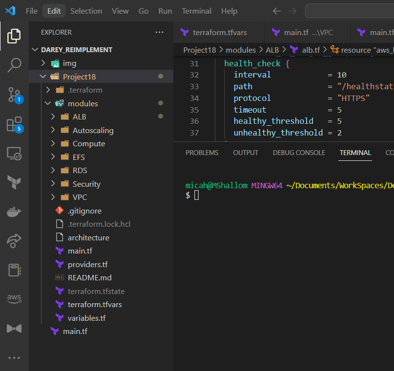

## Initializing Terraform

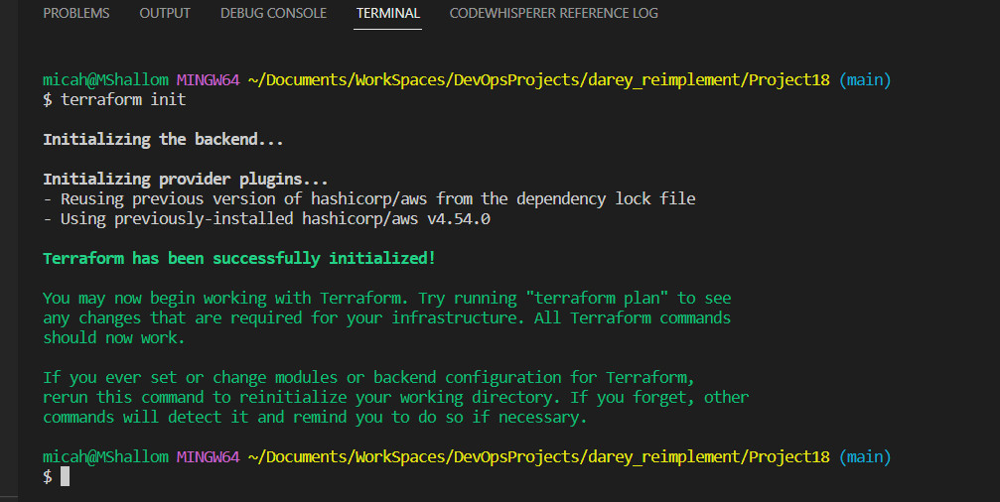

## Creating Loadbalancer resources

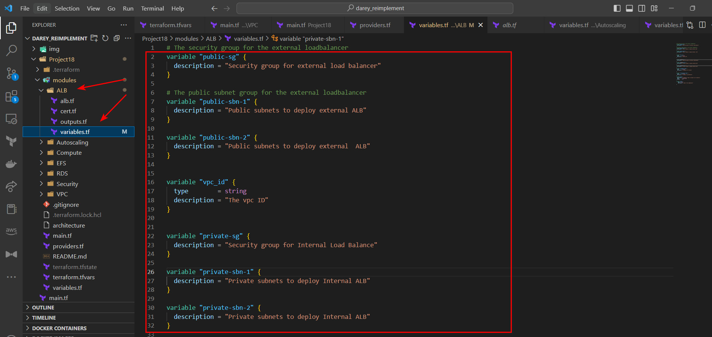
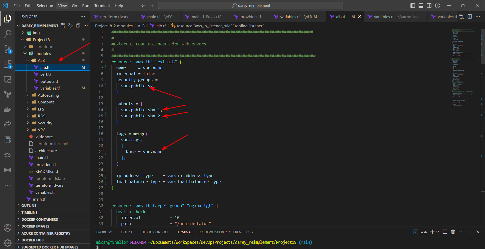

## Creating VPC resources

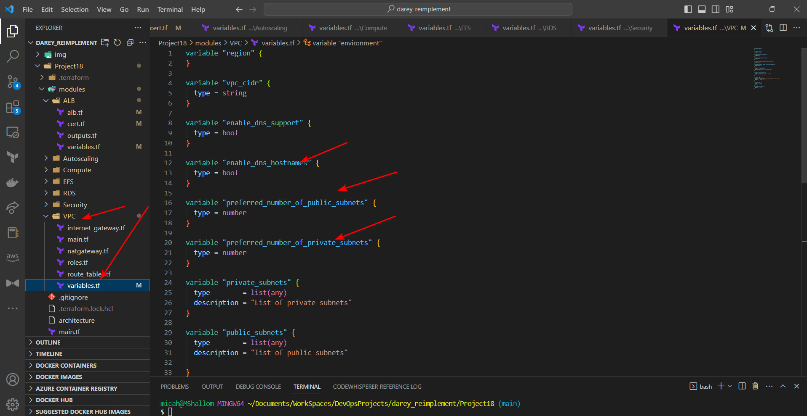
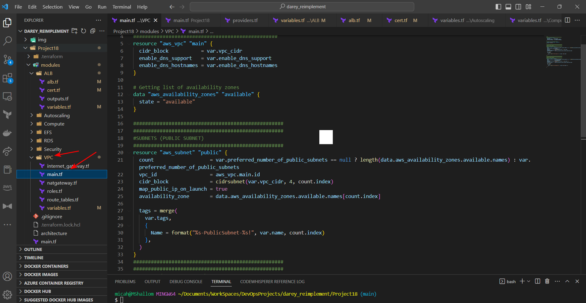
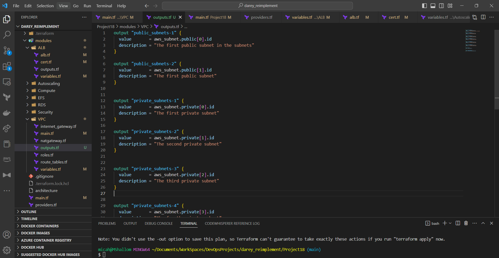

## A look into terraform.tfvars

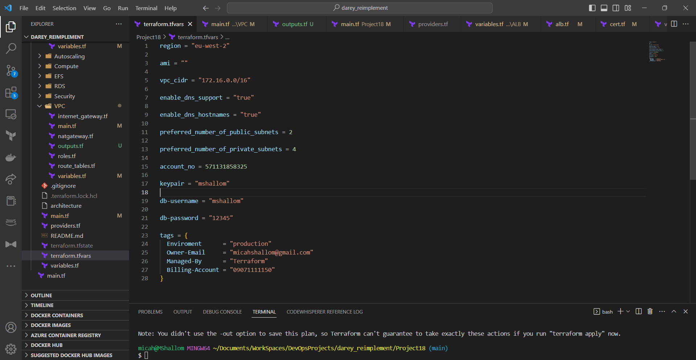

## Passing values into modules via main.tf

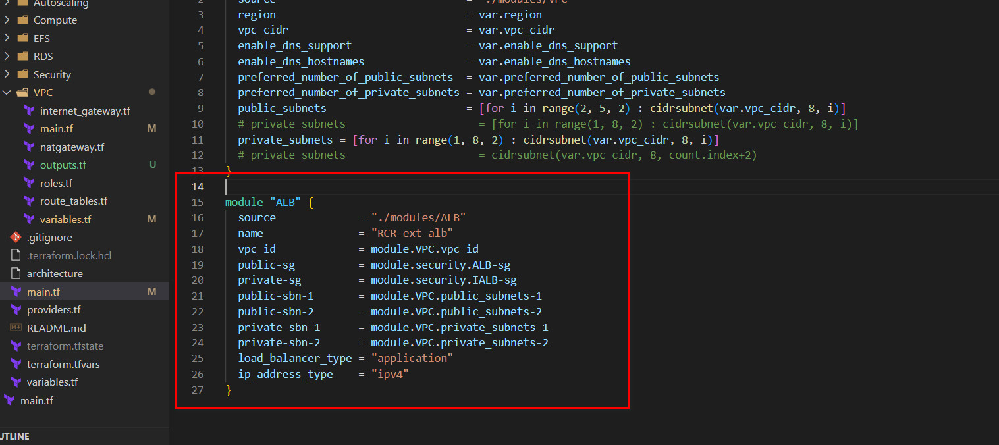

## Creating EFS resource
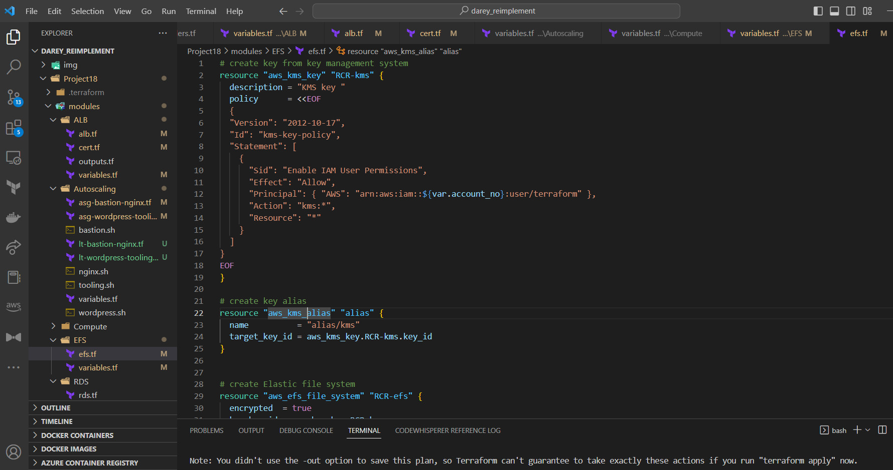
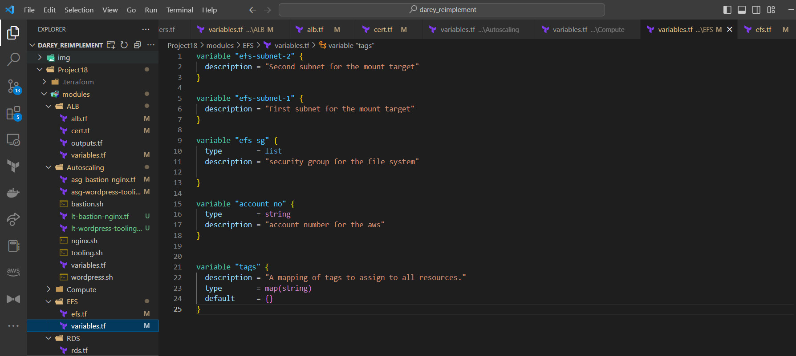

## Creating Security  Group Resources
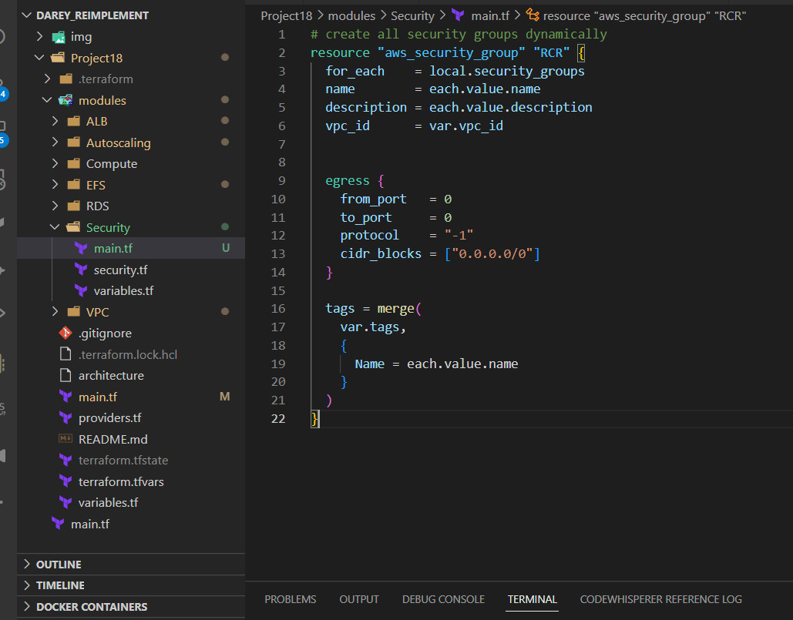
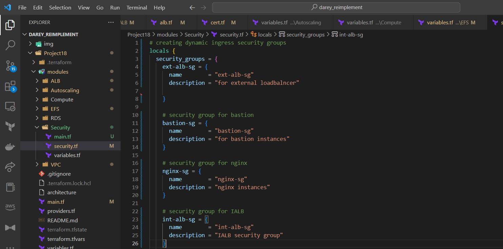
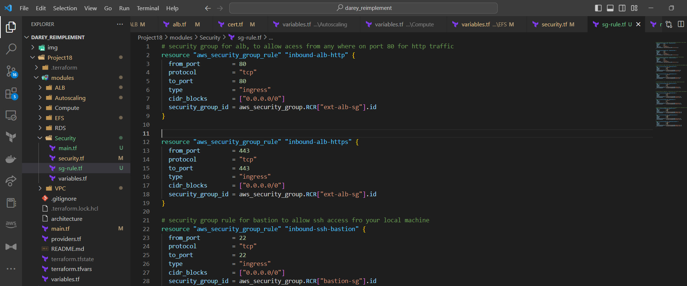
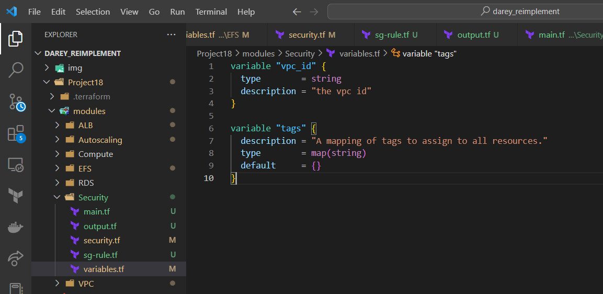

## Configuring S3 backend 
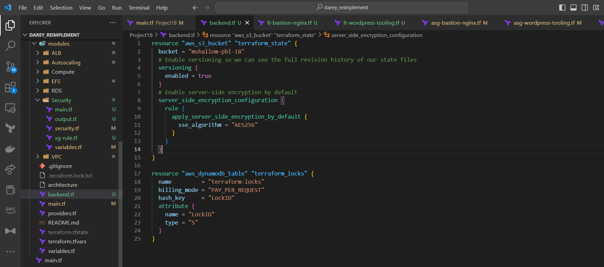

## Configuring Hosted Zone with domain name

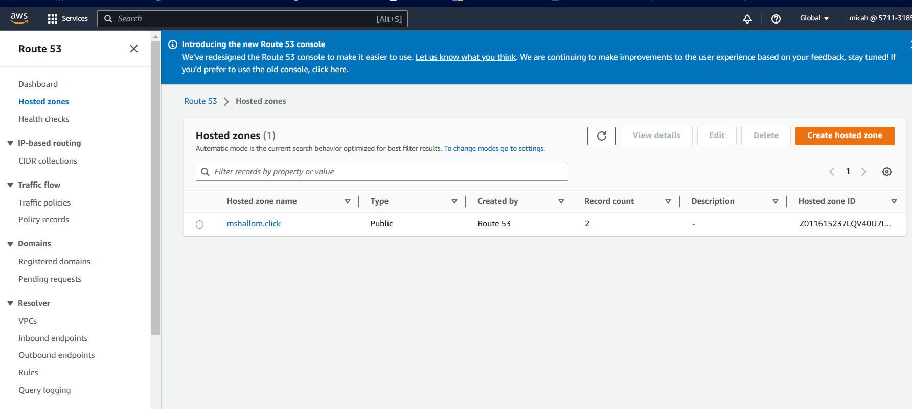