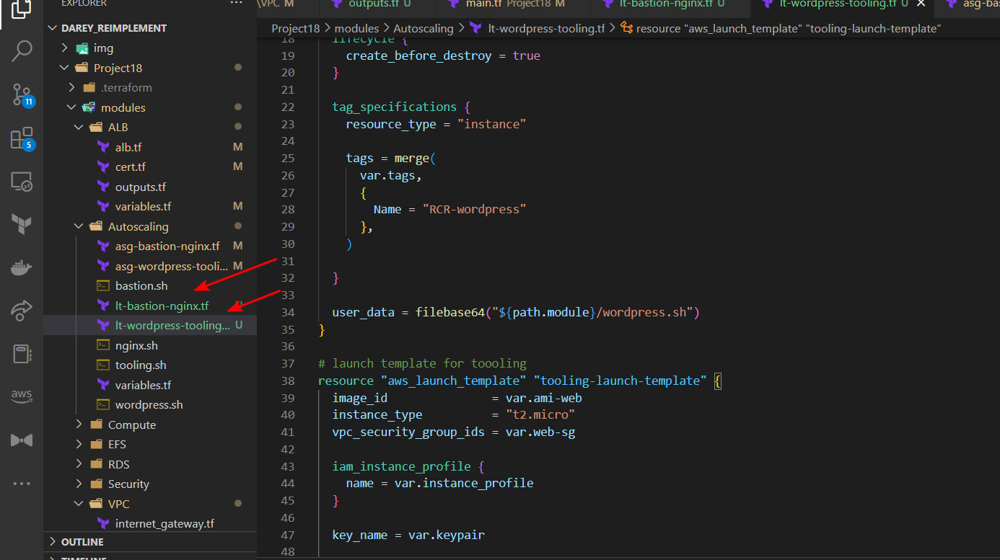

# RCR TERRAFORM ARCHITECTURE
#

#

## Grouping all resources into modules in the modules directory

## Initializing Terraform

## Creating Loadbalancer resources

## Creating VPC resources

## A look into terraform.tfvars

## Passing values into modules via main.tf

## Creating EFS resource

## Creating Security  Group Resources

## Configuring S3 backend 

## Configuring Hosted Zone with domain name

